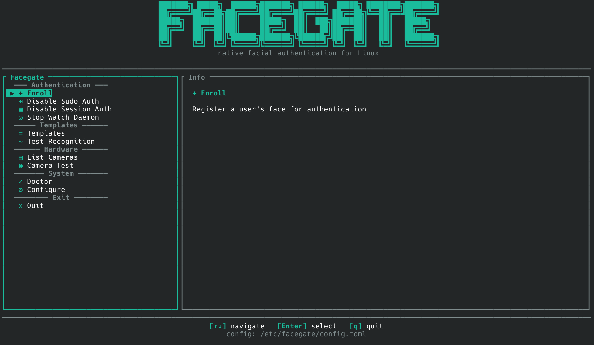

# Facegate

<p align="center">
  <strong>Native Rust facial authentication for Linux PAM</strong>
</p>

<p align="center">
  Face authentication for <code>sudo</code>, login sessions, and screen unlock — fully local, broker-isolated, no cloud, no telemetry.
</p>

<p align="center">
  <a href="https://github.com/me02329/facegate">
    
  </a>
  <a href="https://github.com/me02329/facegate">
    
  </a>
  <a href="https://github.com/me02329/facegate">
    
  </a>
  <a href="https://github.com/me02329/facegate">
    
  </a>
  <a href="https://me02329.github.io/facegate/">
    
  </a>
  <a href="https://github.com/me02329/facegate/blob/master/LICENSE">
    
  </a>
</p>

---

📖 **Full documentation: <https://me02329.github.io/facegate/>**

The site has the threat model, recovery guide, configuration reference,
CLI reference, FAQ (including *"why does it fail in the dark?"*), and
troubleshooting. The README only covers the elevator pitch and
install.

---



---

## What it is

Facegate is a native Linux facial authentication stack written in
Rust. It plugs into PAM via a small native module (`pam_facegate.so`),
captures frames over V4L2, and submits them to a hardened system
daemon (`facegate-brokerd`) that owns the biometric templates and
runs SCRFD + ArcFace under ONNX Runtime. The result: PAM `sudo`,
session login, and screen unlock all driven by the same broker, with
templates never readable from the authenticating user's UID.

Unlike legacy tools that depend on Python, `pam-python`, Python 2, or
fragile dlib builds, Facegate keeps the PAM integration small and
auditable.

## Features

- **Native PAM module** for `sudo`, `su`, login managers (SDDM, GDM,
  LightDM, greetd) and the screen-lock daemon.
- **Privileged broker daemon** (`facegate-brokerd`, since v0.2.0) — a
  dedicated system service running as the unprivileged `facegate` user
  that owns templates, runs SCRFD + ArcFace, and exposes only match
  decisions over a local Unix socket. systemd-hardened
  (`NoNewPrivileges`, `MemoryDenyWriteExecute`, seccomp, no caps, no
  network).
- **Frame-based matching** (`MatchFrame`) — clients submit raw camera
  frames; the broker runs detection, embedding, and comparison itself.
  A same-UID attacker cannot bypass live capture by replaying a
  precomputed embedding.
- **Automatic screen unlock** (Windows Hello style) — a background
  user-service daemon watches `org.freedesktop.login1` Lock signals
  and submits a match as soon as the screen locks.
- **Interactive TUI** with a live status panel (broker, watch, PAM
  scopes, RGB/IR cameras, last auth event, template count) that
  refreshes without user input (v0.3.0).
- **Recovery tooling** — `facegate emergency-disable [--dry-run]`
  restores PAM backups and stops services. Documented shell, TTY,
  chroot, and live-USB recovery flows.
- **Broker administration** — `facegate broker
  {status,health,restart,logs,repair-permissions}`.
- **Scope-specific recognition policy** — `[recognition.sudo]` and
  `[recognition.session]` apply stricter sudo defaults (threshold
  0.60, two required matches) while keeping session unlock
  convenient.
- **Optional RGB+IR cross-check** — when a `[camera.ir]` section is
  set and `[camera.cross_check].enabled = true`, the broker requires
  a synchronised `MatchFramePair` and rejects probes whose capture
  timestamps disagree or whose RGB/IR landmarks fail spatial
  alignment (liveness signal — not a full PAD model; tracked in
  [#25](https://github.com/me02329/facegate/issues/25)).
- **Privacy-preserving audit log** at `/var/lib/facegate/audit.log`
  — coarse outcome/reason only; no images, no embeddings, no
  similarity scores.
- **Multi-distro packaging** (`.deb`, `.rpm`, `.pkg.tar.zst`) via
  nFPM, GPG-signed when a release key is configured.

See the docs site for the full feature list and architecture
breakdown.

---

## Install

```sh
# Debian / Ubuntu
sudo dpkg -i facegate_*.deb

# Fedora / RHEL
sudo dnf install ./facegate-*.rpm

# Arch Linux
sudo pacman -U ./facegate-*.pkg.tar.zst
```

Releases live at <https://github.com/me02329/facegate/releases> with
SHA256 checksums next to each archive. The package's postinstall
script creates the `facegate:facegate` system user, fetches the ONNX
Runtime shared library and the SCRFD + ArcFace ONNX models from a
configured mirror, and enables `facegate-brokerd.service`.

For development from a clone:

```sh
git clone https://github.com/me02329/facegate.git
cd facegate
sudo ./install-dev.sh
```

Full install notes:
<https://me02329.github.io/facegate/getting-started/installation.html>

---

## Quick start

```sh
sudo facegate setup       # guided: camera → enrol → PAM wiring
facegate status           # broker reachability + enrolment summary
facegate                  # interactive TUI (live status panel)
```

To enable auto-unlock:

```sh
systemctl --user enable --now facegate-watch.service
```

---

## Status

Facegate is **alpha**. The IPC protocol is at v5 and still evolving —
pin the broker and the CLI together when you upgrade. The trust
boundary in `facegate-brokerd` is the headline v0.2.0 achievement;
v0.3.0 added operator tooling, scope-specific recognition policy, and
the optional RGB+IR cross-check.

Known gaps tracked on the roadmap:

- **Full PAD model** — [#25](https://github.com/me02329/facegate/issues/25)
- **TPM2 sealing of templates at rest** — [#26](https://github.com/me02329/facegate/issues/26)
- **IR-native recognition** — depends on
  [#16](https://github.com/me02329/facegate/issues/16) (model backend
  swap). The current RGB-trained ArcFace cannot match against IR
  crops; see the [FAQ entry on low light][faq-lowlight].

[faq-lowlight]: https://me02329.github.io/facegate/faq.html#why-does-facegate-fail-to-recognise-me-in-the-dark

---

## Security disclosures

Use **GitHub private vulnerability reporting** at
<https://github.com/me02329/facegate/security/advisories/new>, with
email fallback documented in [`SECURITY.md`](SECURITY.md). Windows:
7 days acknowledgement / 14 days triage / 90 days disclosure.

---

## Contributing

See [`CONTRIBUTING.md`](CONTRIBUTING.md). Short version: work happens
on `dev`; `master` only receives `Merge dev: …` commits. Both CI and
the release workflow pin Rust 1.95.0 via `rust-toolchain.toml`.

---

## License

GPL-3.0-or-later. See [`LICENSE`](LICENSE).
